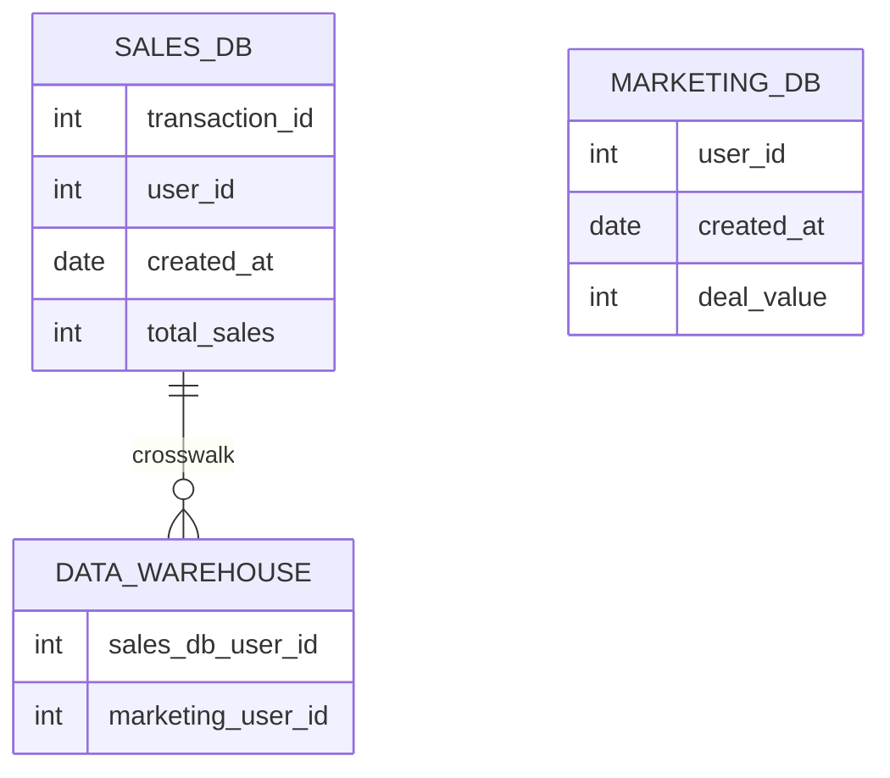

# What is Benjy?

Benjy is a data as code tool that lets teams define data transformation workflows as human-readable configuration files 
they can version, reuse, and share. 
A simple yaml file is all that’s needed to populate data from any connected source to any other, 
and perform the needed transformations along the way.

With Benjy it's possible to

* Deploy a new data warehouse as easily as you would deploy a docker container - all in version control
* Build data search, lineage, and discovery directly into your organization, all in code.
* Version control ad-hoc analytics queries, and much more.

## How does it work?

Benjy sits on top of your existing infrastructure providing a simple, declarative, and most importantly,
version controlled system for describing your data environment. 
Rather than writing complicated SQL code to build data pipelines you instead write basic
`yaml` files describing what data should be placed where. 
Benjy handles the boilerplate for you.

<!---
## Data Relations

In order to build

**TODO**: Need to sort out how to fix the connection labels

-->